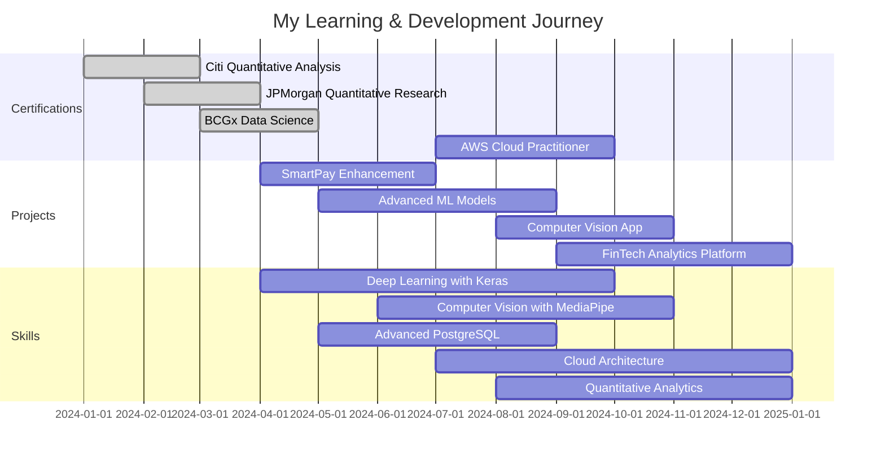

<div align="center">


### 🚀 ABOUT ME
<table>
<tr>
<td width="50%" valign="top" align="left">

```python
class Developer:
    name = "Isaac Masila"
    role = "Data Science Student | Quantitative Analyst"
    
    current_stack = [
        "Python (Keras, MediaPipe)",
        "Flutter & Dart",
        "JavaScript & Node.js",
        "PostgreSQL & AWS",
    ]
    
    certifications = [
        "Citi - Market Quantitative Analysis",
        "JPMorgan - Quantitative Research", 
        "BCGx - Data Science",
        "PLP - Software Engineering",
    ]
    
    exploring = [
        "Advanced Deep Learning",
        "Computer Vision Systems",
        "Cloud Architecture",
        "Financial Analytics",
    ]
    
    motto = "If data is the new oil,"
            "I'm building the refinery!"
```

<div align="left">

### 💫 What I'm Up To

🧠 Building **intelligent systems** with AI & Machine Learning  
📊 Applying **quantitative analysis** from financial certifications  
📱 Developing **full-stack applications** with Flutter & PostgreSQL  
☁️ Deploying **cloud solutions** on AWS infrastructure  
🔬 Exploring **computer vision** with MediaPipe & Keras

### 🤝 Let's Collaborate

✨ Open to **AI/ML • Data Science • Fintech** projects  
🌟 Interested in **quantitative analysis & data-driven solutions**

</div>
</td>
<td width="50%" align="center">

</td>
</tr>
</table>


## 🛠️ Tech Arsenal

<details open>
<summary><b>Click to expand my toolkit</b></summary>

<br/>

**AI & Data Science**
```
Python      ████████████████████░  95%
Keras       ██████████████████░░░  90%
MediaPipe   █████████████████░░░░  85%
scikit-learn ████████████████████░  95%
```

**Mobile & Frontend**
```
Flutter     ████████████████████░  95%
Dart        ████████████████████░  95%
JavaScript  ████████████████████░  95%
React       ██████████████████░░░  90%
```

**Backend & Cloud**
```
Node.js     ████████████████████░  95%
PostgreSQL  ████████████████████░  95%
AWS         █████████████████░░░░  85%
Firebase    ████████████████████░  95%
```

**Tools & DevOps**
```
Git         ████████████████████░  95%
Docker      ████████████████░░░░░  80%
Linux       █████████████████░░░░  85%
Postman     ████████████████████░  95%
```

</details>

## 📊 GitHub Statistics

<div align="center">
  
  
</div>

<div align="center">
  
</div>

<div align="center">
  <!-- Contribution Graph -->
  
</div>

##

## 🏆 **ACHIEVEMENTS & TROPHIES**

<div align="center">

</div>

##

## 🚀 Featured Projects

<div align="center">

| Project | Description | Tech Stack | Impact | Links |
|---------|-------------|------------|--------|-------|
| 💡 **SmartPay Billing System** | Real-time water & electricity billing system with AWS & PostgreSQL | Flutter • Node.js • PostgreSQL • AWS | Full-stack solution, cloud deployed | [View Code](https://github.com/Masila-Isaac/Smartpay-Billing-system-) |
| 🎓 **Predictive Dropout Model** | School dropout prediction using ML & data analysis | Python • Keras • scikit-learn • ML | 92% prediction accuracy, data-driven insights | [View Code](https://github.com/Masila-Isaac/Predictive-Droupout-Model) |
| 🌤️ **MimWeathers** | Weather app with real-time updates & interactive UI | Flutter • APIs • UI/UX | User-friendly design, API integration | [View Code](https://github.com/Masila-Isaac/MimWeathers) |
| 💼 **Dencrib Website** | Business services website with responsive design | HTML • CSS • JavaScript • Bootstrap | Professional portfolio, mobile-responsive | [View Code](https://github.com/Masila-Isaac/Group10) |

</div>


## 🎓 Learning Roadmap

##


## 📈 Impact Metrics

<div align="center">

```yaml
📊 Data Science Projects: 4+
📱 Production-Ready Apps: 2+
💻 Lines of Code: 10,000+
🔥 GitHub Commits: 200+
🤖 ML Models Trained: 3+
☁️ Cloud Deployments: 2+
```

### Performance Achievements

| Category | Achievement | Details |
|:--------:|:-----------:|:-------:|
| 🧠 **AI/ML Accuracy** | 92% prediction | Dropout model precision |
| 💳 **Payment Systems** | Real-time billing | SmartPay water/electricity |
| ☁️ **Cloud Integration** | AWS deployment | Scalable architecture |
| 📊 **Data Analysis** | Quantitative insights | Financial market analysis |
| 📱 **Cross-Platform** | Flutter apps | iOS & Android compatibility |

</div>

##


## 🤝 Let's Connect

<div align="center">

  <a href="https://github.com/Masila-Isaac">
    
  </a>
  <a href="https://www.linkedin.com/in/isaac-masila-6266752b8/">
    
  </a>
  <a href="mailto:masilaisaacmim@gmail.com">
    
  </a>

  <br />

  <h3>I'm always open to:</h3>
  
  🤖 **AI & Data Science** collaborations  
  📱 **Full Stack Development** projects  
  🏦 **FinTech & Quantitative Analysis**  
  🌍 **Open Source** contributions  
  ☕ **Tech discussions** & knowledge sharing  

</div>

##

## 💡 Fun Facts

<div align="center">

```yaml
☕ Coffee Dependency: High
🎵 Coding Playlist: Lo-fi + Deep Focus
🌙 Peak Productivity: Late night coder
📚 Currently Reading: ML research papers
🎯 2024 Goal: Build 3 AI-powered applications
🚀 Next Project: Computer vision with MediaPipe
♟️ Hobby: Chess & strategic thinking
```

</div>

##

## 🐍 Contribution Snake

<picture>
  <source media="(prefers-color-scheme: dark)" srcset="https://raw.githubusercontent.com/Masila-Isaac/Masila-Isaac/output/github-snake-dark.svg" />
  <source media="(prefers-color-scheme: light)" srcset="https://raw.githubusercontent.com/Masila-Isaac/Masila-Isaac/output/github-snake.svg" />
  
</picture>

---

<div align="center">

### 💭 Quote of the Day


##


<div align="center">

### 💭 Daily Inspiration


<p>
  ⭐️ If you like my work, feel free to leave a star on my repositories!  
  <i>— <a href="https://github.com/Masila-Isaac">Masila Isaac</a></i>
</p>


</div>
'''